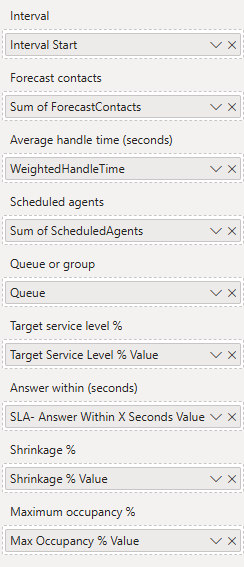
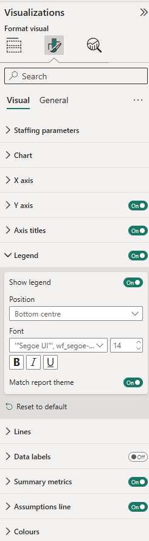

# Erlang C Staffing Planner — user guide

Calculate how many agents each interval needs, compare it to what you have
rostered, and see where the day is short.

This guide takes about fifteen minutes end to end. The one step worth not
skipping is [Average handle time](#step-3-the-one-measure-you-must-build) — it
is the only field that will silently give you wrong answers if you get it wrong.

---

## What you need

| | |
|---|---|
| Power BI Desktop | Current version |
| Interval data | One row per interval, with contact volume and handle time |
| Roster data | Optional. Agents scheduled per interval |

Interval data usually comes out of the ACD or WFM platform — Five9, Genesys,
NICE, Talkdesk, Amazon Connect, Cisco and similar all export it. Any grain
works as long as it is consistent: 15, 30 or 60 minutes.

---

## Step 1: Add the visual

If you bought the visual from Microsoft AppSource, **there is no file to
download**. It installs from inside Power BI.

1. In Power BI Desktop, open the **Visualizations** pane.
2. Click the **⋯** at the bottom of the icon list.
3. Choose **Get more visuals**.
4. Search for **Erlang C Staffing Planner** and click **Add**.


The icon then appears in the Visualizations pane and stays there for new
reports. Updates arrive automatically.

### If your organisation deploys visuals centrally

Some tenants block AppSource and have an administrator publish approved visuals
instead. If **Get more visuals** shows an **Organizational** tab, or shows
nothing at all, ask whoever administers Power BI in your organisation to add
it.

### Licences

Buying through AppSource gives you licences to assign, not a key to enter.
Assign them per user in the [Microsoft 365 admin
center](https://admin.microsoft.com). After a licence is assigned it can take
up to an hour to be recognised -- refresh the browser, or restart Desktop.

Without a licence the visual still runs in **evaluation mode**, which
calculates your own data with your own parameters over a limited number of
intervals. See [evaluation mode](evaluation-mode) for what is and is not
included.

---

## Step 2: Load your data

Your table needs, at minimum:

| Column | Example | Notes |
|---|---|---|
| Interval start | `2026-03-02 09:30` | Date/time. The **start** of the interval |
| Contacts | `210` | Contacts offered in that interval |
| Handle seconds | `66394` | **Total** seconds, not an average — see step 3 |
| Queue | `Billing` | Optional |
| Scheduled agents | `67` | Optional |

If your source gives you an *average* handle time rather than a total, that is
fine — step 3 covers both.

### Check the interval column

The visual identifies each interval by its timestamp, so the field you map to
**Interval** has to tell two days apart. A `Date/Time` column does that on its
own and is the simplest thing to use.

Power BI sometimes reads a timestamp as text instead. In the **Data** view,
select the interval column and check the type in **Column tools**. If it says
`Text`, use **Transform data** and set it to `Date/Time`.


If your model splits the date and the time into separate columns, that works
too, as long as the field you map still separates one day from the next. What
does not work is mapping a bare time-of-day with the date discarded: every
Monday 09:00 then keys to the same interval as every Tuesday 09:00, and a week
silently folds into a single day.

The check takes five seconds. Hover any interval and read **Queues** in the
tooltip. It should equal the number of queues you actually have. If you run
three queues over five days and it says 15, your days have folded together.

---

## Step 3: The one measure you must build

**Average handle time cannot be a plain column.** This is the single most
common way to get a confidently wrong answer out of this visual.

Dropping a column called `AHT` into the field well makes Power BI average it —
and an average of averages is not the average.

> One interval handles 500 contacts at 200 seconds. The next handles 5 contacts
> at 900 seconds. The true weighted average is **207 seconds**. Averaging the
> two averages gives **550**. Offered load comes out nearly three times too
> high, and the visual will confidently recommend staffing for it.

The visual cannot detect this. Nothing in the data distinguishes a correctly
weighted measure from a badly weighted one.

### If your data has total handle seconds

Right-click your table → **New measure**:

```dax
Weighted AHT =
DIVIDE(
    SUM( Interactions[HandleSeconds] ),
    SUM( Interactions[Contacts] )
)
```

`DIVIDE` rather than `/` so an interval with no contacts returns blank instead
of an error.

### If your data only has an average per interval

Reconstruct the total first, then divide:

```dax
Weighted AHT =
DIVIDE(
    SUMX( Interactions, Interactions[AvgHandleTime] * Interactions[Contacts] ),
    SUM( Interactions[Contacts] )
)
```


### Check it worked

Put `Weighted AHT` in a card visual with no filters. It should look like a
plausible handle time for your operation — a few hundred seconds for voice. If
it comes out in the thousands, the measure is summing rather than averaging.

---

## Step 4: Add the visual and map the fields

Drop the visual on the canvas and fill the field wells:

| Field well | Drop in | Required |
|---|---|---|
| **Interval** | Your interval start column | Yes |
| **Forecast contacts** | Contacts (Sum) | Yes |
| **Average handle time (seconds)** | `Weighted AHT` | Yes |
| **Scheduled agents** | Scheduled (Sum) | No |
| **Queue or group** | Queue | No |

Until the first three are filled the visual tells you which one is still
missing rather than drawing anything.



### The date hierarchy trap

Power BI creates an automatic date hierarchy and will drop your interval column
in as **Date Hierarchy** — which throws away the time and collapses a week of
half-hours into seven points.

Click the dropdown on the field chip in the well and pick the plain field name
instead:


On the left is the broken state — if your well looks like that, the visual is
being handed a hierarchy rather than timestamps. On the right is the fix.

To turn it off everywhere: **File → Options and settings → Options → Data Load
→ Auto date/time**, unchecked.

---

## Step 5: Set your staffing parameters

Open the **Format** pane. Under **Staffing parameters**:

**Service level (SLA)** — the two halves of your service target:

| Setting | Default | Means |
|---|---|---|
| Answer this share of contacts | 80% | The percentage half |
| Within this many seconds | 20s | The time half |

Together: "80% answered within 20 seconds."

**Staffing and intervals**:

| Setting | Default | Means |
|---|---|---|
| Shrinkage | 30% | Paid time not available for contacts: breaks, training, absence, meetings |
| Maximum occupancy | 85% | Ceiling on the share of productive time spent handling contacts |
| Interval length | 30 minutes | **Must match your data's grain** |

### Interval length is not detected

It has to match the grain of your interval column, and the visual does not
guess. Guessing would mean inferring from the spacing between values, which
goes wrong in exactly the cases that matter — overnight gaps, intervals removed
by a filter, a queue that only opens at 08:00. A wrong value silently changes
every number on the chart.

### About maximum occupancy

Occupancy is the share of an agent's productive time spent actually handling
contacts. Sustained occupancy above roughly 85% is a well-documented driver of
burnout and attrition, which is why this is enforced as a **hard constraint**
and not just reported.

It is why this visual sometimes asks for more agents than a calculator that
only targets service level. Those calculators can return answers implying 90%+
occupancy. This one will not, unless you raise the ceiling yourself.

---

## Step 6: Let report readers change the parameters

The Format pane is **author-only**. Someone reading your published report
cannot open it — so out of the box they cannot ask "what if shrinkage were
35%?", which is often the whole reason they opened the report.

Four optional field wells fix that. Bind a what-if parameter to one and the
reader gets a slicer.

### Creating a what-if parameter

1. **Modeling** tab → **New parameter** → **Numeric range**.
2. Fill it in. For shrinkage:

   | | |
   |---|---|
   | Name | `Shrinkage` |
   | Minimum | `0` |
   | Maximum | `60` |
   | Increment | `1` |
   | Default | `30` |

3. Leave **Add slicer to this page** ticked.
4. Click **Create**.


Power BI creates three things, and the distinction matters:

| What | Named | Use it? |
|---|---|---|
| A table | `Shrinkage` | No |
| A column inside it | `Shrinkage` | **No** |
| A measure | `Shrinkage Value` | **Yes** |

The measure looks like this:

```dax
Shrinkage Value = SELECTEDVALUE('Shrinkage'[Shrinkage], 30)
```

`SELECTEDVALUE` reads whatever the slicer is set to, falling back to your
default when nothing is selected.

5. Drag the **measure** — `Shrinkage Value`, not the column — into the visual's
   **Shrinkage %** field well.

In the Data pane the two sit together under the same table name and are easy to
confuse. The measure carries a calculator icon; the column does not. Dropping
the column in gives you the whole parameter range at once rather than the
selected value.

Move the slicer; staffing recalculates.


### A layout that works

Four parameters is a lot of slicers. An arrangement that keeps them out of the
way:

- **Across the top** — a date range slicer, and day-of-week buttons for quick
  filtering
- **The visual** taking the bulk of the canvas
- **Down the right edge** — the four parameters as compact single-value cards,
  stacked

That keeps every assumption visible and adjustable without crowding the chart,
and it is the layout the sample report uses.

### The four override wells

| Field well | Overrides | Suggested range |
|---|---|---|
| Target service level % | The share half of your SLA | 50 to 99 |
| Answer within (seconds) | The seconds half | 10 to 120 |
| Shrinkage % | Shrinkage | 0 to 60 |
| Maximum occupancy % | The occupancy ceiling | 60 to 95 |

Whatever you do not map keeps its Format-pane value, so you can expose just
shrinkage and leave the rest fixed.

### Use whole numbers, not decimals

**These take `80`, not `0.8`.** Build your parameter over `0` to `95`, not `0`
to `1`.

A parameter built over 0–1 is the easy mistake and would otherwise compute
staffing for a 0.8% service-level target quite happily. The visual catches it
and tells you to multiply by 100 rather than calculating with it. Zero is
allowed — 0% shrinkage is a real setting.

### Interval length is deliberately not overridable

It has to match your data's grain, which is a property of the model rather than
a question a reader should be able to change.

---

## Reading the chart


| Mark | Means |
|---|---|
| Solid line | **Required scheduled agents** — the answer, after shrinkage |
| Dashed line | **Scheduled agents** — what you have rostered |
| Shaded band | The gap. Red and hatched when short, green when surplus |
| Faint dotted line | Required *productive* agents, before shrinkage. Off by default |

The hatch on an understaffed band is deliberate, not decoration — colour-vision
deficiency, greyscale printing and high-contrast mode each remove hue, so
shortfall is marked by texture as well as colour.

### The summary metrics

| Metric | Means |
|---|---|
| **Forecast SLA** | The service level your roster is expected to deliver overall. Red when below target |
| **Understaffed** | Intervals where scheduled staffing is below requirement |
| **Largest deficit** | The worst single-interval shortfall |
| **Peak required** | The highest scheduled requirement in range |
| **Intervals on target** | The share of intervals that individually clear the target |

**Forecast SLA and Intervals on target answer different questions.** One says
what service level the day will deliver; the other says how many intervals
clear the bar. A day can have two thirds of its intervals on target and still
miss badly overall, if the misses land where the volume is.

Forecast SLA is weighted by contacts, because service level is a ratio of
contacts answered in time to contacts offered. A quiet overnight interval
sitting at 100% does not get to cancel out a morning peak sitting at 40%.

### The assumptions line

Under the metrics, the parameters that produced the numbers:

```
80% in 20s · 30% shrinkage · 85% max occupancy · 30-min intervals
```

It follows whatever actually drove the calculation, so a reader moving a
what-if slicer watches the assumptions move with it. A staffing number is not a
fact on its own — it is a fact *given* those parameters.

### Tooltips

Hover any interval for the full calculation: contacts, handle time, offered
load in Erlangs, required productive agents, required scheduled agents,
scheduled agents, the gap, expected service level and occupancy.


That chain is deliberately complete so you can reconcile any interval against a
spreadsheet by hand.

---

## Checking the maths yourself

Pick your busiest interval and work it through:

1. Read contacts and weighted AHT from the tooltip.
2. **Offered load** = `contacts × AHT ÷ interval seconds`.
   For 300 contacts at 280 seconds in a 30-minute interval:
   `300 × 280 ÷ 1800 = 46.7` Erlangs.
3. **Required productive agents** will be somewhat above that — typically 10 to
   20 percent higher at an 80/20 target.
4. **Required scheduled** = that divided by `1 − shrinkage`.

If required staffing comes out at three times offered load, or below it, the
AHT measure is the first thing to check.

---

## Working with queues

Mapping a queue field calculates each queue separately and adds the resulting
agent counts together.

This is the **no-pooling assumption**: each queue is staffed by its own people.
It is the conservative reading, and matches how most contact centres actually
schedule.

**If your agents genuinely handle all queues from one pool, do not map the
queue field.** Pooling more traffic into one queue needs *fewer* total agents,
so calculating them separately will overstate what you need.

Service level and occupancy are not aggregated across queues — there is no
honest single number for "the service level across three queues" — so a
multi-queue interval shows the per-queue breakdown in its tooltip instead.

---

## Formatting



Every text element takes font, size, bold, italic, underline, alignment and
colour: X axis, Y axis, axis titles, legend, data labels, summary metrics and
the assumptions line.

Colour has a **Match report theme** switch, on by default, so text follows your
report's own colour and stays readable on a dark theme. Turn it off to choose
your own.

Other cards:

- **X axis** — label format (seven presets plus custom patterns) and rotation.
  Rotating fits far more labels before the axis starts dropping them.
- **Y axis**, **Data labels**, **Summary metrics** — display units and decimal
  places.
- **Lines** — solid, dashed or dotted, and width, for each series.
- **Colours** — required, scheduled, understaffed, surplus.

### Custom date formats

Under **X axis → Label format → Custom**:

| Token | Gives | Token | Gives |
|---|---|---|---|
| `yyyy` `yy` | 2026, 26 | `HH` `H` | 14, 14 |
| `MMMM` `MMM` | March, Mar | `hh` `h` | 02, 2 |
| `MM` `M` | 03, 3 | `mm` | 30 |
| `dddd` `ddd` | Monday, Mon | `tt` | PM |
| `dd` `d` | 02, 2 | | |

**Put literal text in single quotes.** `HH'h'mm` gives `14h30`; without quotes
the `h` is read as a token. `''` is an apostrophe.

---

## Troubleshooting

**Required staffing looks far too high.**
Almost always the AHT measure. Put it in a card and check it reads as a
plausible handle time. See [step 3](#step-3-the-one-measure-you-must-build).

**Only a handful of points on the chart, one per day.**
The interval field is bound to the Date Hierarchy. Use the field chip dropdown
to pick the plain field.

**Staffing changes when I switch interval length, but the data did not.**
Correct — that setting tells the visual how long each interval is. Set it to
match your data's grain.

**Scheduled staffing doubles when I change interval length.**
Your scheduled measure is summing rather than levelling. Scheduled agents is a
headcount *at a moment*, not a quantity that accumulates.

**"This field takes whole-number percentages."**
A what-if parameter is returning a decimal. Build it over 0–95, not 0–1.

**A gap in the scheduled line.**
Those intervals have no roster value. A blank is treated as unknown, not as
zero agents, so the line breaks rather than dropping to the floor.

**"Queue grouping requires a licence."**
Per-queue and pooled staffing give different answers, so the visual will not
guess which you meant. Remove the queue field or upgrade.

---

## What this visual does not do

Version 1 is deliberately narrow:

- No schedule or shift generation
- No break or lunch optimisation
- No multi-skill or skill-based routing
- No abandonment modelling (Erlang A), retrials or callbacks
- No forecasting — it sizes staffing for a forecast you supply
- No writeback to your data

**Erlang C assumes** Poisson arrivals, exponentially distributed handle times,
no abandonment, and infinite queue patience. Real queues abandon, which makes
Erlang C generally **conservative** — it tends to recommend slightly more staff
than a model with abandonment would. That is usually the safer direction for a
staffing plan, but it is worth knowing.

---

## Privacy

All calculations run inside Power BI on your machine. The visual makes no
network requests, requests no web-access permissions, and sends no data
anywhere. Your contact volumes never leave your tenant.
